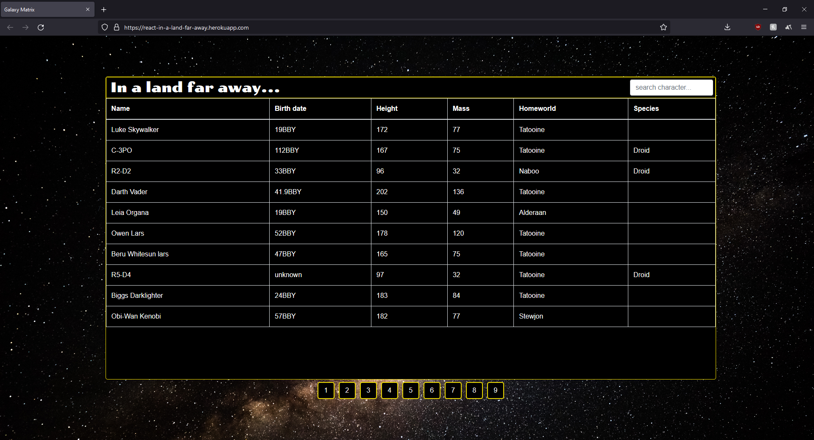

## galaxy-matrix

`galaxy-matrix` is an application to display information regarding the characters in the Star Wars galaxy. This is an easy introduction working with a REST API in making a request, working with the data, and incorporating it into a React app.

[Live Demo](https://react-budget-buddy.herokuapp.com/)

### Summary

Are you a Star Wars fan? How well do you know the characters from the Star Wars galaxy? [SWAPI](https://swapi.dev/) provides information such as the birth date, homeworld, and specie of each character. Test your knowledge and see if you really know the characters!

`galaxy-matrix` is a React application that displays character information pulled from the SWAPI API. SWAPI is a simple, public API that does not require any authentication; however, provides experience making HTTP requests and working with the response. I struggled with working with a paginated response and determing the best way in structuring the data.

List of React concepts applied to this project:
1. React Hooks
2. HTTP Requests

### Author

* **Anderson Duong** - Full-Stack Developer